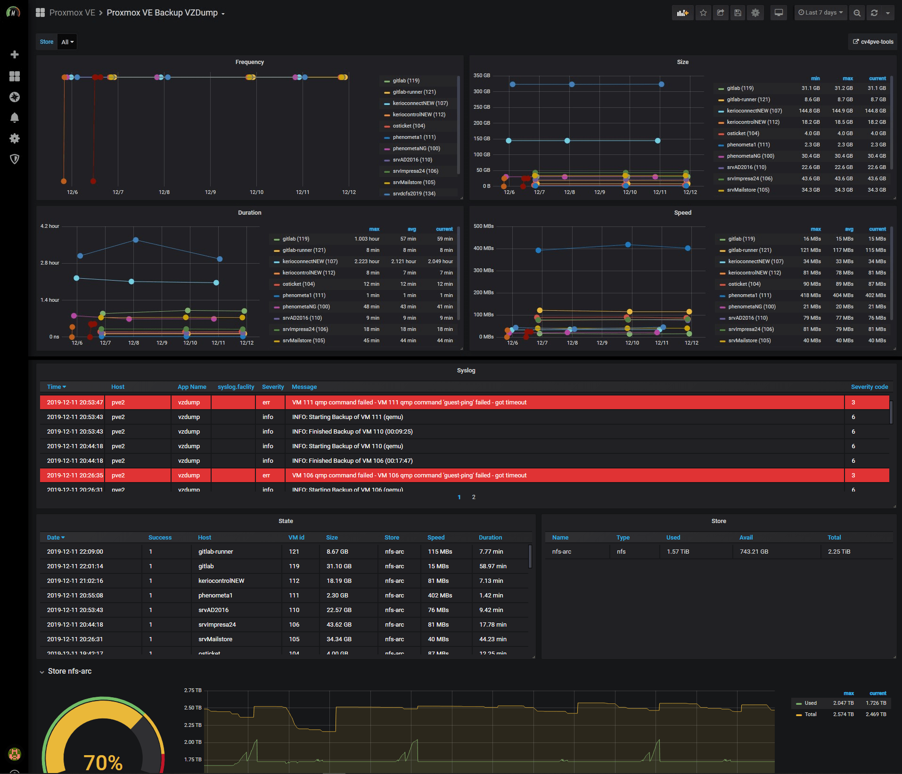

# cv4pve-metrics

[](https://github.com/Corsinvest/cv4pve-metrics/blob/master/LICENSE.md)

## Copyright and License

Copyright: Corsinvest Srl
For licensing details please visit [LICENSE.md](https://github.com/Corsinvest/cv4pve-metrics/blob/master/LICENSE.md)

## Commercial Support

This software is part of a suite of tools called cv4pve-tools. If you want commercial support, visit the [site](https://www.cv4pve-tools.com)

## Introduction

Script for saving metrics into InfluxDB

## cv4pve-metrics-vzdump

Copy script cv4pve-metrics-vzdump.sh and edit variable in file.

```sh
INFLUXDB_HOST=""
INFLUXDB_PORT="8086"
INFLUXDB_NAME="proxmox"
INFLUXDB_USER=""
INFLUXDB_PASSWORD=""
```

Empty **INFLUXDB_USER** no authentication required.

Edit file "/etc/vzdump.conf" and change tag "script:" with path script.
e.g

```sh
script: <PATH SCRIPT>/cv4pve-metrics-vzdump.sh
```



## cv4pve-metrics-autosnap

Copy script cv4pve-metrics-autosnap **sh** or **ps1** in directory to execute.
Edit cv4pve-metrics-autosnap set variable.

```sh
INFLUXDB_HOST=""
INFLUXDB_PORT="8086"
INFLUXDB_NAME="proxmox"
INFLUXDB_USER=""
INFLUXDB_PASSWORD=""
```

Empty **INFLUXDB_USER** no authentication required.

Execution in linux shell

```sh
root@debian:~# cv4pve-autosnap --host=192.168.0.100 --username=root@pam --password=fagiano --vmid=111 snap --label='daily' --keep=2 --script cv4pve-metrics-autosnap.sh
```

Execution in windows

Create script batch add line

```bat
PowerShell <PATH SCRIPT>\cv4pve-metrics-autosnap.ps1
```

Execute autosnap

```cmd
C:\Users\Frank>cv4pve-autosnap.exe --host=192.168.0.100 --username=root@pam --password=fagiano --vmid=111 snap --label='daily' --keep=2 --script script.bat
```


